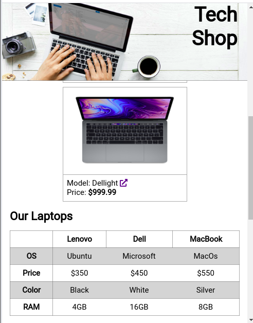

# Test 2 - UI-Basics

## Test Info
 
* In diesem Projekt gibt es eine index.html-Datei, eine style.css-Datei und ein Ordner "images" mit Bildern. In den Dateien sind schon die Grundlagen für eine Website für einen Computer-Geschäft vorhanden.
* Deine Aufgabe ist es, die Anleitung unten zu folgen, um die Website zu verbessern. 
* Viel Glück! 

 *Hinweis: Schau dir zuerst die Website an, bevor du mit den Aufgaben anfängst.*

## Test Anleitung: 

### Bilder 
* Verwende das Bild [hero.jpg](./solution/images/hero.jpg) als Hintergrundbild in dem Header. Das Bild sollte die ganze Breite des Headers einnehmen, es sollte sich nicht wiederholen und es sollte zentriert sein.  

### Position
* Ändere die  Position des Headers zu fixed. Der Header sollte oben auf der Seite sein und kein anderen Inhalt auf der Seite überdecken. 

### Attribute
*  Füge einen `fontawesome` Icon ein bei allen Links, die das Attribut `"target="_blank"` haben. Du solltest das Attribut verwenden, um die Elemente  auszuwählen  und den Icon direkt in der Css-Datei hinzufügen. Du solltest hierfür das Pseudo-element `::after` auf dem Attribut Selektor verwenden. Die Schriftart (font-family) soll "FontAwesome"  sein und den Inhalt (content) sollte `" \f35d"` sein.

### Responsive Design
* Verwende Flex-box um das Layout der Karten  (cards) in dem Abschnitt "Product Card" responsiv zu machen. Die Karten sollten auf Mobile in einer Spalte erscheinen (column) und auf Tablet/Desktop (breakpoint: `768px`) in einer Reihe (row).  Die Spalte und Reihe sollten jeweile zentriert auf der Seite sein. Die Reihe solle sich nicht über mehrere Zeilen strecken, d.h. kein Umbruch haben. 

* Die Überschrift in dem  Header sollte rechts ein Padding  von `7rem` haben auf Displays größer als `768px`.

### Tabellen
* Füge unter dem `<h2>`-Tag im Abschnitt "Product Information" eine Tabelle mit folgender Struktur ein: 

* Einen grauen Rahmen um die Tabelle, die Tabellen-Headers und die Tabellen-Reihen (rows). Die Rahmen sollten einander überlappen (collapse) wenn nötig. Jede ungerade (odd) Reihe sollte weiß sein und jede gerade (even) Reihe sollte grau sein. Die Tabelle sollte `100%` der Breite einnehmen.

#### Struktur für die Tabelle 
|------|Lenovo|Dell|Macbook|
|-----------|------|----|-------|
|**OS**|Ubuntu|Microsoft|MacOS|
|**Price**|$350|$450|$550|
|**Color**|Black|White|Silver|
|**RAM**|4GB|16GB|8GB|

#### Bilder von der Tabelle:

### Formulare (Forms)

* Im Abschnitt "Contact Form", erstelle ein Formular (form) mit: 

  - einem  Inputfeld für den Nutzernamen
  - einem Inputfeld für die E-Mail-Adresse 
  - einem Textfeld (textarea) für eine Nachricht
  - einem Button 
  
  Das Formular sollte unter dem `h2`-Element stehen.

  Der Button sollte die Klasse `submit-btn` haben. 
  
  Erstelle auch  `label`- Elemente für jedes Inputfeld und für das Textfeld, z.B: "Tell us who you are", "Tell us how to contact you", "How can we help you?".

* Füge Typen und Platzhalter-Texte (placeholder text) ein für die Inputfelder und das Textfeld. 
  - Das erste Inputfeld sollte den Typ `text` haben und den Platzhalter-Text: "Please fill in your full name". Es sollte auch eine Mindestlänge `minimum length` von 1 haben.

  - Das zweite Inputfeld sollte vom Typ Email sein und den Platzhalter-Text: "Please enter your email". Es sollte auch eine Mindestlänge von 5 haben. 
  -  Das Textfeld sollte folgenden Platzhalter-Text haben: "Send us a message!" und eine Mindestlänge von 1.
* Bei  Focus, ändere die Farbe des Rahmens (outline color) von den Inputfeldern und vom Textfeld zu Blau.

### Links im Footer  
* In dem Abschnitt "Footer Links", füge eine Punktliste (unordered list) ein unter dem  `h3`-Element. Die Liste sollte die Klasse `icon-list` haben. 

- Füge 3 Items ein in die Liste. Jedes Item sollte die Klasse `icon` haben.

- In jedem  Item sollte ein Link eingebettet sein. Füge nur ein "#" -Symbol  ein im Attribut  `href`. 

- Finde drei Icons von sozialen Medien, die du in den Links einbettest (d.h. die Icons sind die Links), z.B. zu Instagram, Linked in und Twitter.

