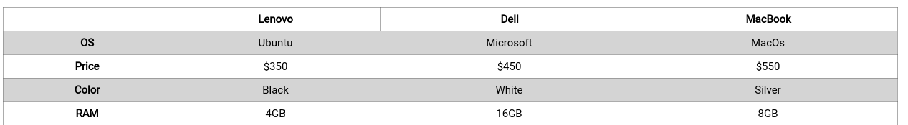
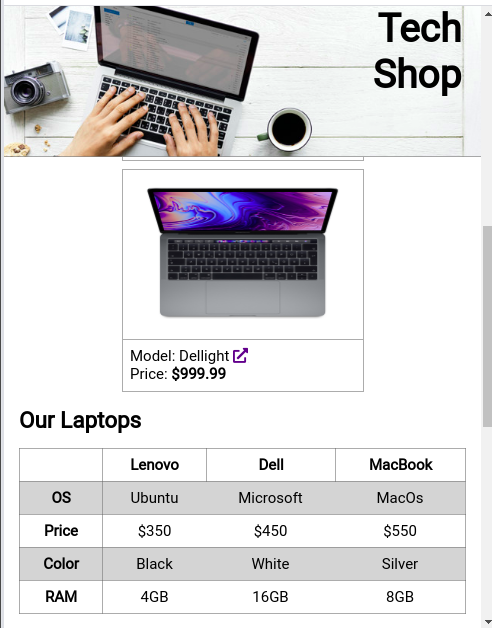

# Test - UI-Basics

## Test Instructions
* In the test folder in this repository, there are both html and css files as well as an images folder. These files contain the foundations of a computer store landing page! 
* The task is to follow the instructions below to complete the landing page.
* Good luck! 

### Images 
* Add the [hero.jpg](./solution/images/hero.jpg) as a background image in the header of the page. The background image should cover the whole header, it should not repeat itself and the image should be at the center of the header.

### Positioning 
* Change the position of the header to fixed. The header should be aligned at the top of the page and it should not cover any content of the website.

### Attributes
* Add a `fontawesome` icon to all of the links which have contain the attribute `"target="_blank"`. You must select the elements by this attribute in css and add the icon directly in css. You should use the pseudo-element `::after` on the attribute selector, the font should be "FontAwesome" and the content should be `" \f35d"`.

### Responsive Design
* In the "Product Card" section, use flex to make the cards should appear as a column for mobile and as a row for tablet/desktop (breakpoint: `768px`). The column and row should appear in the center of the page. The row should not appear on multiple lines.

* Give the header text padding on the right of `7rem` at the breakpoint of `768px`.

### Tables 
* In the "Product Information" section, create a table with the structure below. The table should be placed beneath the `h2` element.

* Add a grey solid border to the table, table headers and table rows. Make sure the borders collapse into one border. Every odd row should be white, every even row should be grey. The table should take up `100%` of the width.

#### Table Data Structure
|------|Lenovo|Dell|Macbook|
|-----------|------|----|-------|
|**OS**|Ubuntu|Microsoft|MacOS|
|**Price**|$350|$450|$550|
|**Color**|Black|White|Silver|
|**RAM**|4GB|16GB|8GB|

#### reference table

### Forms 
* In the "Contact Form" section, create a form with an input field for the user's name, an input field for the user's email, textarea for a message and submit button. The submit button should have a class of `submit-btn`  The form should be placed beneath the `h2` element. Create `label` elements for each input field and textarea e.g. "Tell us who you are", "Tell us how to contact you", "How can we help you?".

* Add types and placeholder text to the input fields and textarea. The first input field should have a type of text, the following placeholder text "Please fill in your full name" and it should have a `minimum length` of 1. The second input field should have a type of email, the following placeholder text "Please enter your email" and it should have a `minimum length` of 5. The textarea should have the following placeholder text: "Send us a message!" and it should have a `minimum length` of 1.
* On focus, change the outline color of the input fields and textarea should change to blue.

### Footer Links 
* In the "Footer Links" section, add an unordered list beneath the `h3` element. The unordered list should have a class of `icon-list`. Inside the unordered list, add three list items. Each list item should have a class of `icon`. Every list item should have an anchor link nested inside. Only add an "#" symbol to the `href`. Find three social media icons to place inside the anchor links, e.g. instagram, linked in, twitter.

